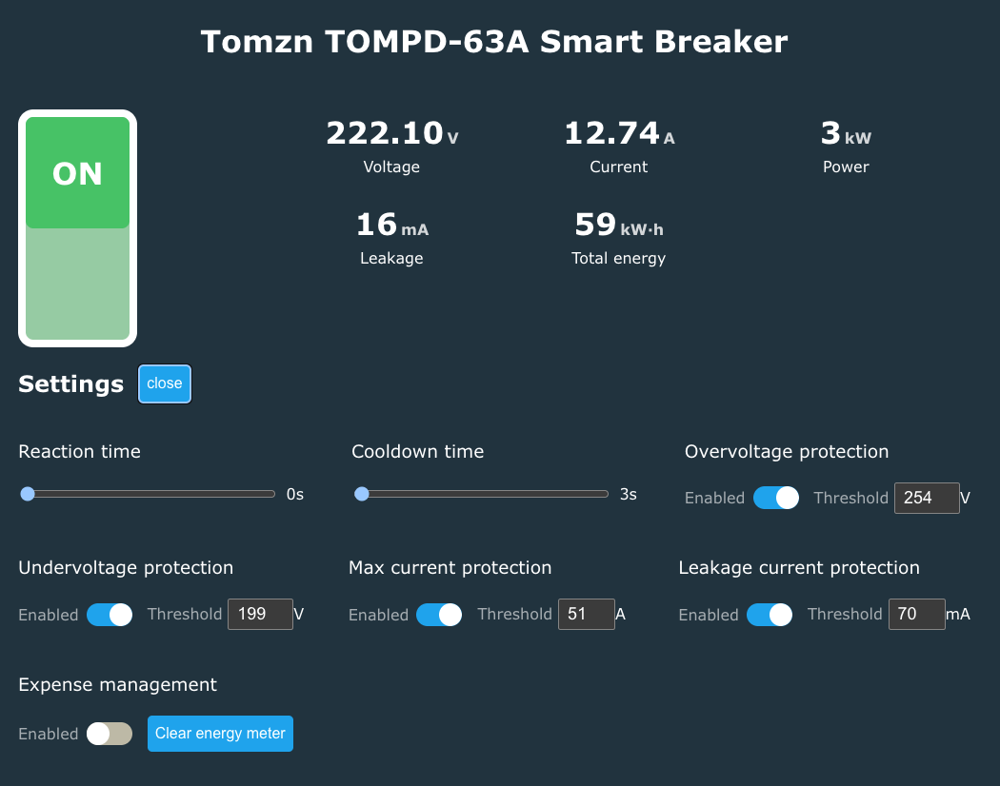

# TOMPD-63 Web UI

Modern web interface for configuring and monitoring TOMPD-63 smart breakers.



## Features

- **Real-time Monitoring**

  - Voltage, current, and power measurements
  - Leakage current detection
  - Total energy consumption
  - Fault status with detailed error messages

- **Protection Settings**

  - Leakage current protection (10-99mA)
  - Overvoltage protection (110-300V)
  - Undervoltage protection (85-220V)
  - Overcurrent protection (1-63A)
  - Configurable reaction time (1-30s)
  - Configurable recovery time (1-500s)

- **Prepayment Mode**

  - Energy balance tracking
  - Energy top-up functionality
  - Automatic cutoff when balance depleted

- **Main Controls**
  - Remote relay on/off
  - Energy counter reset
  - Prepayment mode toggle

## Technology Stack

- TypeScript
- Vite
- Native Web Components
- UART communication via OpenBK7231T firmware

## Development

```bash
# Install dependencies
npm install

# Run development server
npm run dev

# Build for production
npm run build

# Create distribution archive
npm run archive
```

## UART Message Protocol

The UI communicates with the breaker via UART using the Tuya MCU protocol:

- **Message Format**: `55 AA 00 06 [length] [dpId] [type] [payload_length] [payload] [checksum]`
- **DpIDs**: Device-specific data point identifiers for different settings
- **Data Types**: BOOL (0x01), INT (0x02), RAW (0x00)

## Configuration

Create a `.env` file in the project root to configure the device URL for development:

```bash
# .env
VITE_DEVICE_BASE_URL=http://192.168.0.178
```

If not set, the app will use `window.location.origin` (the current page's origin). In production, when hosted on the device itself, no configuration is needed as it will automatically connect to the device serving the UI.

## License

Private project
